# guardtower — design

**Date:** 2026-07-29
**Status:** approved
**Repo:** `dashworthy` marketplace (alongside `signal`, `verity`)

## What it is

A Claude Code plugin providing one command: **`/guardtower:review <url|number>`**. It reviews a
GitHub pull request or GitLab merge request by dispatching four analysts — reuse, security, code
smell, abstraction — whose findings are verified and scored by an arbitrator against a published
rubric. Anything below 80 is discarded. What survives is presented for in-scope / out-of-scope
triage, and the in-scope items are posted back to the PR as review comments.

It is explicitly invoked. There is no hook, no injected message, and no local-diff mode.

## The two rules

> **Rule one — Guardtower reports.** It never modifies the repository under review, never writes
> a test, never changes your checked-out branch, and never posts to a forge without explicit
> per-item approval.

> **Rule two — the context firewall.** The conductor reads the arbitrator's brief and nothing
> else. Not a diff body, not an analyst's finding, not a file an analyst read.

Rule two requires a mechanism, not an instruction — see **Enforcing the context firewall**.

**Ask, don't configure.** Nothing about a run is written to disk for the next one to read.
Threshold and lens selection are asked fresh every run. Verity's README records that its removed
config layer accounted for roughly 15 of ~34 defects found during its build; guardtower does not
reintroduce that layer.

## How a run flows

```mermaid
flowchart TD
    START["/guardtower:review &lt;url or number&gt;"] --> F1["Detect the forge from origin.<br/>Self-hosted or ambiguous: ask, never guess"]
    F1 --> F2{"gh / glab present<br/>and authenticated?"}
    F2 -->|no| STOPCLI["Name the tool and how to fix it — stop.<br/>Never post a reduced set silently"]
    F2 -->|yes| F3["Resolve the PR/MR: base sha, head sha,<br/>changed paths. Paths only, never diff contents"]
    F3 --> F4{"Any reviewable<br/>file changed?"}
    F4 -->|no| STOPNONE["Nothing to review — stop"]
    F4 -->|yes| WT["Fetch the head ref and add a DETACHED<br/>worktree in a temp dir.<br/>Your branch is never switched"]
    WT --> SNAP["Snapshot the main tree: numstat + untracked.<br/>Taken before the FIRST subagent"]
    SNAP --> MAP["Map the repo via subagent, inside the worktree:<br/>existing modules, stack, conventions"]
    MAP --> AGREE["Agree the threshold — default 80 —<br/>and which lenses to run"]
    AGREE --> BRIEF

    subgraph PASS ["The pass — one iteration, never repeated"]
        BRIEF["Dispatch brief: base sha, head sha,<br/>worktree path, changed paths, repo map"]
        BRIEF --> L1["surveying-for-reuse"]
        BRIEF --> L2["reviewing-for-security"]
        BRIEF --> L3["detecting-code-smell"]
        BRIEF --> L4["simplifying-through-abstraction"]
        L1 --> STAGE
        L2 --> STAGE
        L3 --> STAGE
        L4 --> STAGE
        STAGE[("<b>.guardtower/&lt;run&gt;/findings/</b><br/>one JSON per lens.<br/>Analysts return ONLY a receipt —<br/>the conductor never sees a finding")]
        STAGE --> ARB["Arbitrator is handed the paths<br/>and reads the files itself"]
        ARB --> VER{"Does the cited evidence<br/>still hold at the head sha?"}
        VER -->|no| DROPPED["Dropped with a reason.<br/>Never scored"]
        VER -->|yes| SCORE["Score value and urgency 0-100.<br/>composite = 0.6 x value + 0.4 x urgency"]
        SCORE --> GATE{"composite at or above<br/>the threshold?"}
        GATE -->|no| DISCARD["Discarded"]
        GATE -->|yes| PASSED["Returned to the conductor"]
    end

    PASSED --> RECON{"Reconcile the main tree against the snapshot:<br/>anything touched outside .guardtower/ ?"}
    RECON -->|violation| HALTR["HALT — surface the paths and their diff.<br/>Never auto-revert"]
    RECON -->|clean| WRITEBRIEF["Conductor renders the brief<br/>from references/brief-template.md"]
    WRITEBRIEF --> TRIAGE{"You triage each finding<br/>that cleared the gate"}
    TRIAGE -->|out of scope| DEFERRED[("&lt;run&gt;/deferred.md<br/>write-only backlog.<br/>Never posted, never read by a later run")]
    TRIAGE -->|in scope| APPROVED[("&lt;run&gt;/approved.md")]
    APPROVED --> FORGE["Post ONE pending review, submitted once:<br/>inline where the line sits in a diff hunk,<br/>summary comment for everything else"]
    FORGE --> CLEAN["Remove the temp worktree.<br/>Report what was posted, dropped and discarded"]
    HALTR --> CLEAN
```



Both stop paths are unconditional. Reconciliation surfaces a violation and stops rather than
reverting it, and a missing or unauthenticated forge CLI stops the run rather than posting a
quietly reduced set of comments. Nothing reaches a pull request that you have not marked in scope
by hand.

## The worktree — why the PR is not read in place

A PR-only tool cannot assume your checked-out branch is the PR. It may be a different branch, it
may be the same branch at a different commit, it may be dirty with unrelated work, and the PR may
come from a fork you have never fetched.

So guardtower never reads the PR through your working tree and never switches your branch:

1. Fetch the head ref — `git fetch origin pull/<n>/head` on GitHub, `git fetch origin
   merge-requests/<n>/head` on GitLab. Both resolve fork-sourced changes.
2. `git worktree add --detach <tempdir> <head-sha>` — a second checkout in a temp directory.
3. Analysts and the mapper read **inside that worktree**. The `<base-sha>...<head-sha>` diff is
   computed there too.
4. Remove the worktree at the end of the run, on every exit path including a halt.

Consequences worth stating: your branch, your index, and your uncommitted work are untouched for
the whole run; an analyst that writes a file inside the temp worktree does no damage, because the
worktree is discarded; and reconciliation therefore only has to watch the **main** tree.

## Skills

| Skill | Role | Runs in |
|---|---|---|
| `reviewing-a-pull-request` | conductor | main context |
| `surveying-for-reuse` | analyst | subagent |
| `reviewing-for-security` | analyst | subagent |
| `detecting-code-smell` | analyst | subagent |
| `simplifying-through-abstraction` | analyst | subagent |
| `arbitrating-findings` | verifier and ranker | subagent |
| `posting-review-comments` | forge poster | subagent |

`commands/review.md` is a thin entry point that takes the PR reference and invokes
`reviewing-a-pull-request`. The flow lives in the skill, not the command, so it is readable and
testable in one place.

The repo mapper is a **reference document**, not a skill — following verity's precedent that work
belonging out of the conductor's context but not reusable in its own right ships as a reference
handed to a subagent as its complete brief.

The four analysts are separate skills rather than one lens-parameterised skill because their
domain guidance genuinely differs (a vulnerability taxonomy has nothing in common with a
duplication search strategy). What they share — the return shape, the evidence requirement, the
read-only rule — lives once in `references/finding-schema.md`.

## The run

Single pass. Verity loops because it writes tests and re-measures; guardtower writes nothing to
the code and measures nothing, so a second iteration would re-derive identical findings.

### Preflight

1. **Detect the forge** from `git remote get-url origin`. `github.com` → `gh`; `gitlab.*` →
   `glab`. Self-hosted or ambiguous → ask the user, do not guess.
2. **Verify the CLI** is present and authenticated (`gh auth status` / `glab auth status`).
   Missing or unauthenticated → name the tool, say how to fix it, and stop. This mirrors verity's
   stance on a missing `jq`: a fixable local problem is not a reason to quietly deliver less.
3. **Resolve the PR/MR** — base sha, head sha, and changed paths. **Paths only**; the conductor
   never reads diff contents.
4. **Stop if nothing reviewable changed.** Say so plainly and exit.
5. **Fetch and add the detached worktree**, per **The worktree** above.
6. **Snapshot the main tree** — `git diff --numstat HEAD` and `git status --porcelain` — before
   dispatching the first subagent, so the mapper is inside the check too.
7. **Map the repo.** Dispatch one subagent with `references/mapping-the-repo.md` as its complete
   brief, pointed at the worktree. It returns existing modules and utilities, stack, conventions,
   test locations. The reuse analyst cannot answer "does this already exist?" from the diff alone,
   and mapping once beats four analysts each re-scanning the tree.
8. **Agree the gate.** Offer the default threshold of 80 and all four lenses; let the user
   override either. Persist neither. A lens the user drops is not dispatched and is named in the
   final report, so a short brief is never mistaken for a clean one.

**Run id.** `<YYYY-MM-DD>-<pr-number>-<suffix>`, where `suffix` is a random lowercase
alphanumeric string of at least six characters — `2026-07-29-482-k3f9qa`. Generate it from the
system's entropy source, never from the model:

```sh
LC_ALL=C tr -dc 'a-z0-9' < /dev/urandom | head -c 6
```

If `.guardtower/<run>/` somehow already exists, regenerate rather than reusing or appending — that
is a `stat`, not a read.

**This removes the last exception to "a run never looks at prior artifacts."** The previous
sequential scheme had to enumerate existing directories to pick the next integer; a random suffix
needs no such lookup, so the rule now holds with no carve-out at all.

### The pass

One analyst per selected lens, dispatched in parallel per
`superpowers:dispatching-parallel-agents`. Each reads the diff and whatever files it needs from
the worktree, writes its findings to `.guardtower/<run>/findings/<lens>.json`, and returns only a
receipt. The arbitrator is then dispatched with a payload naming `finding_paths` (one per lens
actually dispatched), the `worktree`, `base_sha`, `head_sha`, the `threshold` agreed in preflight,
and `lenses_run`. It reads the paths itself, verifies and scores, and returns the items that
cleared the gate.

**Paths alone are not the dispatch.** Two of those fields are load-bearing and neither can be
re-derived downstream: without `threshold` the gate the user agreed in preflight step 8 is
silently discarded and the arbitrator falls back to its own default, making that step decorative;
without `worktree` the arbitrator resolves `target_file` and `existing_solution` against whatever
tree it happens to be standing in — the user's own checkout — so evidence verification, the step
this design rests on, can silently run against the wrong revision. Every skill's declared inputs
are handed over in full at every dispatch site; a dispatch that names a subset is a bug even when
nothing visibly breaks.

**The conductor owns every document under `.guardtower/` except the analysts' finding files.** The
arbitrator returns its passed items and the conductor renders the brief, following verity's split
where subagents return results and the conductor owns the document.

### Enforcing the context firewall

A subagent's return value lands in the caller's context by construction, so "the conductor never
reads analyst output" cannot be achieved by instruction alone. The mechanism:

- Each analyst **writes its findings to `.guardtower/<run>/findings/<lens>.json`** and returns
  only a receipt naming the file and a count.
- The arbitrator is dispatched with those paths — inside the full payload named under **The pass**
  above — and reads them itself.
- The conductor's context therefore grows by one short receipt per lens plus one brief,
  independent of PR size.

The arbitrator's brief is the one subagent output the conductor is permitted to read, and reading
it is required.

### Reconciliation

Analysts are read-only, but nothing mechanically stops a dispatched agent writing — the same gap
verity documents. The worktree absorbs most of the risk, since a write there is discarded with it.
What remains is a write into the **main** tree:

- Snapshot `git diff --numstat HEAD` and `git status --porcelain` **before dispatching the first
  subagent of the run — the mapper**, not just before the analysts. The mapper is read-only by
  instruction and unguarded by anything else, exactly like an analyst.
- Re-measure **after the arbitrator returns** — the last subagent of the pass. One snapshot and
  one re-measurement then bracket every subagent the run dispatches: mapper, analysts, arbitrator.
  Reconciling earlier would leave the arbitrator outside the only check there is. A path is
  **touched** when it is absent from the snapshot or when its added/deleted counts differ from the
  snapshot's.
- Resolve every touched path with `readlink -f` (or `cd "$(dirname …)" && pwd -P`) before
  comparing, so a symlink pointing out of the allowed area is caught by its existence.
- Anything resolving outside `.guardtower/` **HALTS the run**: surface the offending paths and
  their diff to the user and stop. The worktree is still removed.

**Never auto-revert.** Reverting is destructive and cannot distinguish a bug worth diagnosing from
evidence the user needs intact.

Counts, not `git status` alone: a porcelain entry for an already-modified file reads ` M path`
both before and after a write, so a status-only comparison cannot see an agent editing a file that
was already dirty — and running guardtower with unrelated work in progress is normal.

## Findings

Every finding carries hard evidence. A finding the arbitrator cannot confirm against the file is
dropped, not scored low.

| Field | Required | Meaning |
|---|---|---|
| `id` | yes | `<lens>-<nnn>` — `security-003`, `reuse-011`. Assigned by the arbitrator on merge |
| `lens` | yes | `reuse`, `security`, `smell`, or `abstraction` |
| `target_file` | yes | Repo-relative path |
| `target_line` | yes | Line or range the evidence sits at, at the head sha |
| `evidence` | yes | The actual source text at that location — what the arbitrator re-reads to confirm |
| `claim` | yes | What is wrong, as an observable consequence |
| `rationale` | yes | Why it matters, concretely: what breaks, for whom, how they find out |
| `proposal` | yes | What to do instead. Prose, never a patch — guardtower does not modify code |
| `in_diff` | yes | Whether `target_line` falls inside a diff hunk. Decides inline vs summary |
| `also_at` | no | Further `file:line` locations for a finding spanning several files |
| `kind` | reuse only | `reimplements`, `duplicates`, or `diverges` — see the reuse lens below |
| `tier` | reuse only | A JSON number, never a string: `1` already reachable, `2` not yet installed |
| `existing_solution` | reuse only | The thing that already does this: a repo path, a package plus the exact export, or a stdlib/platform API |
| `existing_evidence` | reuse only | Source text or documented signature proving it covers the claim |
| `adoption_cost` | tier 2 only | What adding this dependency costs: supply-chain surface, maintenance, version churn |
| `value` | yes | 0–100, assigned by the arbitrator |
| `urgency` | yes | 0–100, assigned by the arbitrator |
| `composite` | yes | `round(0.6 × value + 0.4 × urgency)`, assigned by the arbitrator |

Analysts set everything except `id`, `value`, `urgency`, and `composite`. Those are the
arbitrator's.

## The reuse lens — challenge the decision to build

The other three lenses review code that exists. This one challenges whether it should exist at
all, and it is deliberately the most aggressive of the four.

**The mandatory question.** For every new file, module, class, exported function, or utility the
PR introduces, the analyst must answer in writing: *what already does this?* A null answer is
acceptable only with the search that produced it — which paths were scanned, which manifest
entries were checked, which stdlib or platform APIs were considered. **Silence is not a null
answer.** This is a burden the lens always carries, not a finding it sometimes emits.

**Two tiers, deliberately asymmetric.**

| Tier | What may be cited | Bar |
|---|---|---|
| 1 — already reachable | Code in this repo, packages already in the manifest, language stdlib and platform APIs, and any installed Claude Code skill | **Aggressive.** Reimplementing something the project can already reach is near-indefensible, and the finding says so plainly |
| 2 — not yet installed | A third-party package that is not currently a dependency | **Qualified.** Only when well-established, and only with `adoption_cost` stated |

The asymmetry is the whole point. Without it the lens degenerates into answering every thirty-line
utility with "add a dependency" — trading a small maintenance cost for a permanent one, and
burning the credibility of every other finding it makes. *Do not hand-roll JWT parsing when `jose`
exists* is a legitimate tier 2 finding. *Import lodash for a three-line `groupBy`* is not.

**Three kinds of finding**, strongest first:

- **`reimplements`** — the PR builds a capability that already exists whole. The strongest claim
  the lens can make.
- **`duplicates`** — specific logic repeated from an existing local implementation.
- **`diverges`** — solves a problem the repo already has an established mechanism for, in a
  different way, leaving two patterns where there was one.

**Evidence has two halves here.** The generic `evidence` field cites the new code. A reuse finding
must *additionally* cite what it claims already exists — `existing_solution` and
`existing_evidence` — and the arbitrator verifies both halves. A finding whose superseding
solution cannot be confirmed to actually cover the requirement is dropped exactly like any other
unverified claim. This closes the lens's characteristic failure: a confident "library X already
does this" where library X does something adjacent.

**Rationalizations, and what they're worth.** The analyst holds the line against these; they are
arguments for triage, not reasons to withhold a finding.

| Excuse | Reality |
|---|---|
| "The existing one doesn't quite fit" | Name the gap. If it's a missing parameter, extending it is smaller than a second implementation — and if you can't name it, it fits. |
| "Ours is simpler" | Simpler today, before the edge cases the existing one already handles arrive. Simplicity measured on day one is not a property of the code. |
| "It's only a few lines" | A few lines that must stay in sync with a few other lines forever. The cost is the divergence, not the length. |
| "I didn't know it existed" | A finding about discoverability, not a justification. Both implementations still ship. |
| "The dependency is heavy" | A real tier 2 objection, and irrelevant to tier 1 — that dependency is already installed. |
| "Refactoring to use it is out of scope" | That is the triage decision, made by a human, *after* the finding exists. Not a reason to withhold it. |

## Scoring

A bare 0–100 with no criteria is not reproducible across runs — the same reason verity spells out
what separates a high-risk finding from a medium one. The rubric is published and both analysts
and arbitrator work to it.

**Value — what accepting it is worth**

| Score | Criterion |
|---|---|
| 90–100 | Removes a live defect, a security hole, or a data-loss path |
| 70–89 | Removes duplication or complexity that has caused, or will predictably cause, a bug |
| 40–69 | Genuine improvement with no concrete failure attached |
| 0–39 | Stylistic preference, or defense-in-depth on a path already guarded elsewhere |

**Urgency — what waiting costs**

| Score | Criterion |
|---|---|
| 90–100 | Ships in this PR and is exploitable or breaking once merged |
| 70–89 | Cost of fixing rises sharply after merge — public API, migration, data shape |
| 40–69 | Same cost later as now |
| 0–39 | Cheaper later, or may become moot |

**Anchor — a merged duplicate is a migration.** A `reimplements` or `duplicates` finding sits at
**70–89** on urgency, not 40–69. Once a duplicate capability merges, callers begin depending on it
immediately, and removing it stops being an edit and becomes a migration. This anchor is stated
explicitly because the alternative reading is the intuitive one and it quietly kills the lens:
value 85 with urgency 60 composites to 75 and is discarded, so an aggressive reuse challenge that
finds real duplication would produce nothing that ever clears the gate. With the correct reading,
85 and 80 composite to 83 and pass.

**Composite:** `round(0.6 × value + 0.4 × urgency)`. Default gate: **80**.

**What 80 buys.** It requires `value 80 + urgency 80`, or `value 100 + urgency 50`. This is a
deliberately narrow gate; most findings will not clear it, and that is the intent. The deferred
file is where the rest lives.

**Tie-break.** Rank by `composite` descending, then `value` descending, then `target_file`
ascending, then `id` ascending — a total order, so two runs over the same findings render an
identical brief.

**Arbitrator verification.** For each finding, re-read `target_file` at `target_line` **in the
worktree** and compare against `evidence`. If the evidence does not hold — the line moved, the
text differs, the cited code is a comment — **drop the finding and record the reason**. Dropped
findings are reported as a count with one-line reasons, never scored.

## Triage and posting

The conductor presents every finding that cleared the gate, with its scores and rationale, and the
user marks each **in scope** or **out of scope**. Nothing is posted until that happens.

- In scope → `.guardtower/<run>/approved.md`, then posted
- Out of scope → `.guardtower/<run>/deferred.md`, never posted

Approved items are posted as **a single pending review, submitted once**, so reviewers get one
notification rather than one per comment:

- `in_diff: true` → an inline review comment on that line.
- `in_diff: false` → a line in the one summary comment.

**Inline anchoring is forge-limited.** GitHub and GitLab only accept an inline comment on a line
present in the diff. A finding whose evidence sits outside the diff hunks — common for reuse
findings, where the duplicated original is untouched code — cannot be inline-anchored. That is a
constraint of the forges, not a design preference, and the command says which findings were
relocated to the summary rather than moving them silently.

## Disk

Grouped by run, so one review is one directory — everything it produced sits together and an old
run is deleted by removing one path.

```
.guardtower/
  2026-07-29-482-k3f9qa/
    findings/
      reuse.json          analyst staging; read by the arbitrator, never across runs
      security.json
      smell.json
      abstraction.json
    brief.md              what cleared the gate
    approved.md           marked in scope, and posted
    deferred.md           marked out of scope — write-only backlog
  2026-07-29-482-7bqm2x/  a second review of the same PR, same day
    …
```

Everything is **write-only across runs**. A later run never reads any of it; it re-derives from the
forge and asks its questions fresh. The deferred file is a backlog to mine or paste into an issue
tracker, not an input.

The temp worktree lives outside the repository and is removed on every exit path.

## Repository layout

```
guardtower/
  README.md
  .claude-plugin/plugin.json
  commands/review.md
  skills/reviewing-a-pull-request/SKILL.md
  skills/reviewing-a-pull-request/references/finding-schema.md
  skills/reviewing-a-pull-request/references/scoring-rubric.md
  skills/reviewing-a-pull-request/references/mapping-the-repo.md
  skills/reviewing-a-pull-request/references/brief-template.md
  skills/surveying-for-reuse/SKILL.md
  skills/reviewing-for-security/SKILL.md
  skills/detecting-code-smell/SKILL.md
  skills/simplifying-through-abstraction/SKILL.md
  skills/arbitrating-findings/SKILL.md
  skills/posting-review-comments/SKILL.md
```

No `hooks/` directory. Plus a `guardtower` entry in `.claude-plugin/marketplace.json`.

Seven subagents per run: one mapper, four analysts, one arbitrator, one poster.

## Prerequisites

- `git` with worktree support
- `gh` (GitHub) or `glab` (GitLab), authenticated — **required**, not optional

`jq` is **not** required. The analysts' finding files are JSON, but the arbitrator reads them with
the Read tool rather than shelling out — so unlike verity, guardtower has no tool whose absence
silently weakens a run.

## Where it sits next to verity

Guardtower reviews a PR that already exists. Verity hardens tests on a diff before it becomes one.
The useful order is verity first, then open the PR, then guardtower — the opposite of what an
earlier draft of this design assumed, and it falls out of guardtower being PR-only. Nothing
enforces this; it is a README note, not a mechanism.

## Appendix — why there is no hook

Guardtower is invoked explicitly, so it needs no injected trigger. An earlier draft had it inject
a `SessionStart` message the way verity does, and that option was tested before being dropped.
Recording the result, since the question will come up again:

Two throwaway plugins carrying verity's exact hook shape were installed at local scope into a
scratch project, and a real headless session was run against them.

- Every matching `SessionStart` hook runs. Three fired (both probes plus an already-installed
  superpowers hook), sharing one `toolUseID`, timestamps 1 ms apart, ~41–46 ms each. They run
  concurrently.
- Their `additionalContext` strings arrive as a single `hook_additional_context` attachment whose
  `content` is an **array of separate strings**. Concatenated, not merged, not overwritten. No
  last-writer-wins and no truncation.
- The model reproduced both sentinel markers on request, confirming both reached its context.

So a second injecting plugin does **not** displace verity's message: the mechanism is safe. Two
caveats would have applied had guardtower shipped one. Order is not guaranteed — in the probe
`beta` preceded `alpha`, neither alphabetical nor obviously install order. And the real risk was
never mechanical but behavioral: two plugins claiming the same trigger moment invite the model to
satisfy one and rationalize away the other, which is exactly the failure verity's table of
rationalizations exists to prevent.

Being command-only removes that risk rather than mitigating it.

## Post-build follow-ups

Not part of the build, listed so they are not lost:

- Add `Edit(./guardtower/**)` and `Write(./guardtower/**)` to `.claude/settings.json`'s deny list
  once the plugin is finished, matching how `signal` and `verity` are frozen.
- Decide whether `.guardtower/` belongs in this repo's `.gitignore`, as `.signal/` is.

## Explicit non-goals

- **No hook and no injection.** See the appendix.
- **No local-diff mode.** The command requires a PR or MR reference. Reviewing uncommitted work is
  not what this tool does.
- **Guardtower does not fix anything.** No apply mode, no implementer subagents. It produces a
  brief and comments.
- **No loop.** One pass per run.
- **No config file.** Nothing read back between runs.
- **No enforcement hook.** As with verity, nothing mechanically prevents a dispatched agent from
  writing to the main tree. The worktree makes most such writes harmless, and reconciliation
  catches the rest after the fact and halts; neither prevents the write itself.
