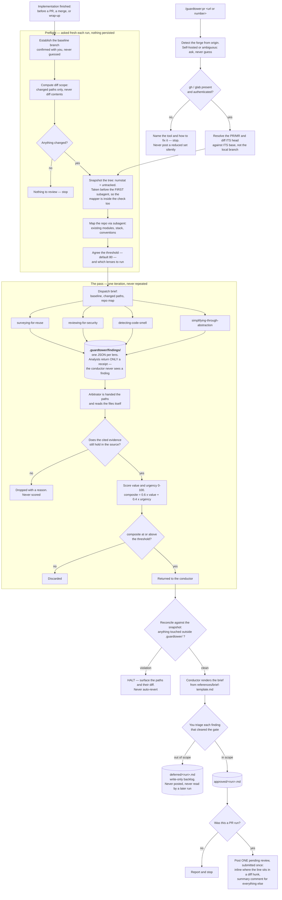

# guardtower — design

**Date:** 2026-07-29
**Status:** approved
**Repo:** `dashworthy` marketplace (alongside `signal`, `verity`)

## What it is

A Claude Code plugin for **diff-scoped advisory code review**. Point it at a branch diff and it
dispatches four analysts — reuse, security, code smell, abstraction — whose findings are verified
and ranked by an arbitrator against a published rubric. Anything scoring below 80 is discarded.
What survives is presented for in-scope / out-of-scope triage, and can be posted to a GitHub or
GitLab pull request as review comments.

It is the review counterpart to verity's test hardening, and runs immediately before it.

## The two rules

> **Rule one — Guardtower reports.** It never modifies application code, never writes a test,
> and never posts to a forge without explicit per-item approval.

> **Rule two — the context firewall.** The conductor reads the arbitrator's brief and nothing
> else. Not a diff body, not an analyst's finding, not a file an analyst read.

Rule two requires a mechanism, not an instruction — see **Enforcing the context firewall**.

**Ask, don't configure.** Nothing about a run is written to disk for the next one to read.
Baseline branch, threshold, and lens selection are asked fresh every run. Verity's README records
that its removed config layer accounted for roughly 15 of ~34 defects found during its build;
guardtower does not reintroduce that layer.

## How a run flows

Two entry points, one path. A local run infers its baseline from git; `/guardtower:pr` takes its
diff scope from the forge instead. Everything after that is identical — there is no second code
path for PR runs.



The two HALT paths are unconditional. Reconciliation surfaces a violation and stops rather than
reverting it, and the forge path stops rather than posting a quietly reduced set of comments.
Nothing reaches a pull request that you have not marked in scope by hand.

## Injection

`hooks/hooks.json` and `hooks/session-start.sh`, identical in shape to verity's: `SessionStart`,
matcher `startup|clear|compact`, a `sh` script that prints one `hookSpecificOutput` JSON object
and exits 0. It does not block, does not touch git, reads and writes no file, and does not depend
on `jq`.

Message:

```
Guardtower applies once implementation work is finished and before the diff is handed off -
before opening a PR, before merging, before declaring work done.
It runs BEFORE verity: review the diff, settle what is in scope, then harden tests against the
code that is actually shipping.
At that point, invoke the `conducting-diff-review` skill.
```

### Coexistence with verity — proven, not assumed

Two throwaway plugins carrying verity's exact hook shape were installed at local scope into a
scratch project and a real headless session was run against them. Findings:

- Every matching `SessionStart` hook runs. Three fired (both probes plus the already-installed
  superpowers hook), sharing one `toolUseID`, timestamps 1 ms apart, ~41–46 ms each. They run
  concurrently.
- Their `additionalContext` strings arrive as a single `hook_additional_context` attachment whose
  `content` is an **array of separate strings**. Concatenated, not merged, not overwritten. No
  last-writer-wins and no truncation.
- The model reproduced both sentinel markers on request, confirming both reached its context.

So verity's injected rule is not displaced by guardtower's. Two consequences shape the design:

1. **Order is not guaranteed.** In the probe, `beta` preceded `alpha` — neither alphabetical nor
   obviously install order. Guardtower must not assume it appears before or after verity.
2. **The real risk is behavioral.** Both plugins claim the same trigger moment. Two competing
   "you must do this now" directives invite the model to satisfy one and rationalize away the
   other. The mitigation is wording: guardtower's message names a **sequence** (guardtower, then
   verity) rather than competing for the slot. Verity's own message is silent on ordering, so
   this adds a sequence without contradicting anything — which matters, because
   `.claude/settings.json` denies writes to `./verity/**` and its message cannot be edited.

## Skills

| Skill | Role | Runs in |
|---|---|---|
| `conducting-diff-review` | conductor | main context |
| `surveying-for-reuse` | analyst | subagent |
| `reviewing-for-security` | analyst | subagent |
| `detecting-code-smell` | analyst | subagent |
| `simplifying-through-abstraction` | analyst | subagent |
| `arbitrating-findings` | verifier and ranker | subagent |
| `posting-review-comments` | forge poster | subagent, dispatched by the command |

The repo mapper is a **reference document**, not a skill — following verity's precedent that work
belonging out of the conductor's context but not reusable in its own right ships as a reference
handed to a subagent as its complete brief.

The four analysts are separate skills rather than one lens-parameterised skill because their
domain guidance genuinely differs (a vulnerability taxonomy has nothing in common with a
duplication search strategy). What they share — the return shape, the evidence requirement, the
read-only rule — lives once in `references/finding-schema.md`.

## The run

Single pass. Verity loops because it writes tests and re-measures; guardtower writes nothing and
measures nothing, so a second iteration would re-derive identical findings.

### Preflight

1. **Establish the baseline.** Try `git symbolic-ref refs/remotes/origin/HEAD`; on failure probe
   local `main`, `master`, `trunk` in that order. **Confirm with the user** however it was
   inferred — never diff against a guessed baseline.
2. **Compute the diff scope.** `git diff --name-only <base>...HEAD` for committed changes, plus
   uncommitted changes and untracked files, excluding `.guardtower/`. **Paths only** — the
   conductor never reads diff contents.
3. **Stop if nothing changed.** Say so plainly and exit.
4. **Map the repo.** Dispatch one subagent with `references/mapping-the-repo.md` as its complete
   brief. It returns a repo map: existing modules and utilities, stack, conventions, test
   locations. The reuse analyst cannot answer "does this already exist?" from the diff alone, and
   mapping once beats four analysts each re-scanning the tree.
5. **Agree the gate.** Offer the default threshold of 80 and all four lenses; let the user
   override either. Persist neither. A lens the user drops is not dispatched and is named in the
   final report, so a short brief is never mistaken for a clean one.

**Run id.** `<YYYY-MM-DD>-<n>`, where `n` is the lowest integer not already used by a file in
`.guardtower/briefs/` for that date. This is the one thing a run looks at prior artifacts for, and
it reads only their filenames — never their contents.

### The pass

One analyst per selected lens, dispatched in parallel per
`superpowers:dispatching-parallel-agents`. Each reads the diff and whatever files it needs itself,
writes its findings to `.guardtower/findings/<run>-<lens>.json`, and returns only a receipt. The
arbitrator is then dispatched with those paths, reads them itself, verifies and scores, and
returns the items that cleared the gate. See **How a run flows** above for the whole sequence.

**The conductor owns every document under `.guardtower/` except the analysts' finding files.**
The arbitrator returns its passed items and the conductor renders the brief, following verity's
split where the writer and verifier return results and the conductor owns the document.

### Enforcing the context firewall

A subagent's return value lands in the caller's context by construction, so "the conductor never
reads analyst output" cannot be achieved by instruction alone. The mechanism:

- Each analyst **writes its findings to `.guardtower/findings/<run>-<lens>.json`** and returns
  only a receipt naming the file and a count.
- The arbitrator is dispatched with those paths and reads them itself.
- The conductor's context therefore grows by one short receipt per lens plus one brief,
  independent of diff size.

The arbitrator's brief is the one subagent output the conductor is permitted to read, and reading
it is required.

### Reconciliation

Analysts are read-only, but nothing mechanically stops a dispatched agent writing — the same gap
verity documents. Guardtower takes the same posture at lower cost:

- Snapshot `git diff --numstat HEAD` and `git status --porcelain` **immediately before
  dispatching the first subagent of the run — the mapper**, not just before the analysts. The
  mapper is read-only by instruction and unguarded by anything else, exactly like an analyst; a
  snapshot taken after it runs would exempt it from the only check there is.
- Re-measure **after the arbitrator returns** — the last subagent of the pass — not after the
  analysts. One snapshot and one re-measurement then bracket every subagent the run dispatches:
  mapper, analysts, arbitrator. Reconciling earlier would leave the arbitrator outside the only
  check there is, which is the same flaw as snapshotting after the mapper. A path is **touched**
  when it is absent from the snapshot or when its added/deleted counts differ from the snapshot's.
- Resolve every touched path with `readlink -f` (or `cd "$(dirname …)" && pwd -P`) before
  comparing, so a symlink pointing out of the allowed area is caught by its existence.
- Anything resolving outside `.guardtower/` **HALTS the run**: surface the offending paths and
  their diff to the user and stop.

**Never auto-revert.** Reverting is destructive and cannot distinguish a bug worth diagnosing
from evidence the user needs intact.

Counts, not `git status` alone: a porcelain entry for an already-modified file reads ` M path`
both before and after a write, so a status-only comparison cannot see an agent editing a file
that was already dirty.

## Findings

Every finding carries hard evidence. A finding the arbitrator cannot confirm against the file is
dropped, not scored low.

| Field | Required | Meaning |
|---|---|---|
| `id` | yes | `<lens>-<nnn>` — `security-003`, `reuse-011`. Assigned by the arbitrator on merge |
| `lens` | yes | `reuse`, `security`, `smell`, or `abstraction` |
| `target_file` | yes | Repo-relative path |
| `target_line` | yes | Line or range the evidence sits at |
| `evidence` | yes | The actual source text at that location — what the arbitrator re-reads to confirm |
| `claim` | yes | What is wrong, as an observable consequence |
| `rationale` | yes | Why it matters, concretely: what breaks, for whom, how they find out |
| `proposal` | yes | What to do instead. Prose, never a patch — guardtower does not modify code |
| `also_at` | no | Further `file:line` locations for a finding spanning several files |
| `value` | yes | 0–100, assigned by the arbitrator |
| `urgency` | yes | 0–100, assigned by the arbitrator |
| `composite` | yes | `round(0.6 × value + 0.4 × urgency)`, assigned by the arbitrator |

Analysts set everything except `id`, `value`, `urgency`, and `composite`. Those are the
arbitrator's.

## Scoring

A bare 0–100 with no criteria is not reproducible across runs — the same reason verity spells out
what separates a high-risk finding from a medium one. The rubric is published and both analysts
and arbitrator work to it.

**Value — what accepting it is worth**

| Score | Criterion |
|---|---|
| 90–100 | Removes a live defect, a security hole, or a data-loss path |
| 70–89 | Removes duplication or complexity that has caused, or will predictably cause, a bug |
| 40–69 | Genuine improvement with no concrete failure attached |
| 0–39 | Stylistic preference, or defense-in-depth on a path already guarded elsewhere |

**Urgency — what waiting costs**

| Score | Criterion |
|---|---|
| 90–100 | Ships in this diff and is exploitable or breaking once merged |
| 70–89 | Cost of fixing rises sharply after merge — public API, migration, data shape |
| 40–69 | Same cost later as now |
| 0–39 | Cheaper later, or may become moot |

**Composite:** `round(0.6 × value + 0.4 × urgency)`. Default gate: **80**.

**What 80 buys.** It requires `value 80 + urgency 80`, or `value 100 + urgency 50`. This is a
deliberately narrow gate; most findings will not clear it, and that is the intent. The deferred
file is where the rest lives.

**Tie-break.** Rank by `composite` descending, then `value` descending, then `target_file`
ascending, then `id` ascending — a total order, so two runs over the same findings render an
identical brief.

**Arbitrator verification.** For each finding, re-read `target_file` at `target_line` and compare
against `evidence`. If the evidence does not hold — the line moved, the text differs, the cited
code is a comment — **drop the finding and record the reason**. Dropped findings are reported as a
count with one-line reasons, never scored.

## Triage

The conductor presents every finding that cleared the gate, with its scores and rationale, and
the user marks each **in scope** or **out of scope**. Nothing is posted or recorded until that
happens.

- In scope → `.guardtower/approved/<run>.md`
- Out of scope → `.guardtower/deferred/<run>.md`

## `/guardtower:pr <url|number>`

1. **Detect the forge** from `git remote get-url origin`. `github.com` → `gh`; `gitlab.*` →
   `glab`. Self-hosted or ambiguous → ask the user, do not guess.
2. **Verify the CLI.** Present and authenticated (`gh auth status` / `glab auth status`). Missing
   or unauthenticated → name the tool, say how to fix it, and stop. Never post a reduced set of
   comments silently. This mirrors verity's stance on a missing `jq`: a fixable local problem is
   not a reason to quietly deliver less.
3. **Resolve the PR/MR** and diff **its** head against **its** base — not the local branch, which
   may have moved.
4. **Run the same pass** — mapper, analysts, arbitrator, gate — and the same triage, writing the
   same `.guardtower/` artifacts under the same run id. A PR run is a local run with its diff
   scope taken from the forge; it is not a second code path.
5. **Post approved items only**, as a single pending review submitted once, so reviewers get one
   notification:
   - Findings pinning to a line **inside a diff hunk** become inline review comments.
   - Everything else goes in one summary comment.

**Inline anchoring is forge-limited.** GitHub and GitLab only accept an inline comment on a line
present in the diff. A finding whose evidence sits outside the diff hunks — common for reuse
findings, where the duplicated original is untouched code — cannot be inline-anchored and goes to
the summary comment. This is a constraint of the forges, not a design preference, and the command
states it in its output rather than silently relocating comments.

Nothing is ever posted without explicit approval, and a deferred finding is never posted.

## Disk

```
.guardtower/
  findings/<run>-<lens>.json   analyst staging; read by the arbitrator, never across runs
  briefs/<run>.md              what cleared the gate
  approved/<run>.md            marked in scope
  deferred/<run>.md            marked out of scope — write-only backlog
```

Everything is **write-only across runs**. A later run never reads any of it; it re-derives from
git and asks its questions fresh. The deferred file is a backlog to mine or paste into an issue
tracker, not an input.

## Repository layout

```
guardtower/
  README.md
  .claude-plugin/plugin.json
  hooks/hooks.json
  hooks/session-start.sh
  commands/pr.md
  skills/conducting-diff-review/SKILL.md
  skills/conducting-diff-review/references/finding-schema.md
  skills/conducting-diff-review/references/scoring-rubric.md
  skills/conducting-diff-review/references/mapping-the-repo.md
  skills/conducting-diff-review/references/brief-template.md
  skills/surveying-for-reuse/SKILL.md
  skills/reviewing-for-security/SKILL.md
  skills/detecting-code-smell/SKILL.md
  skills/simplifying-through-abstraction/SKILL.md
  skills/arbitrating-findings/SKILL.md
  skills/posting-review-comments/SKILL.md
```

Plus a `guardtower` entry in `.claude-plugin/marketplace.json`.

Six subagents per run: one mapper, four analysts, one arbitrator. The PR command adds a seventh
for posting.

## Prerequisites

- `git`
- `gh` or `glab`, authenticated — only for `/guardtower:pr`, not for a local run

`jq` is **not** required. The analysts' finding files are JSON, but the arbitrator reads them with
the Read tool rather than shelling out — so unlike verity, guardtower has no tool whose absence
silently weakens a run.

## Post-build follow-ups

Not part of the build, listed so they are not lost:

- Add `Edit(./guardtower/**)` and `Write(./guardtower/**)` to `.claude/settings.json`'s deny list
  once the plugin is finished, matching how `signal` and `verity` are frozen.
- Decide whether `.guardtower/` belongs in this repo's `.gitignore`, as `.signal/` is.

## Explicit non-goals

- **Guardtower does not fix anything.** No apply mode, no implementer subagents, no reconciliation
  of applied changes. It produces a brief and comments.
- **No loop.** One pass per run.
- **No config file.** Nothing read back between runs.
- **No enforcement hook.** As with verity, nothing mechanically prevents a dispatched agent from
  writing to source. Reconciliation catches it after the fact and halts; it cannot prevent it.
- **Guardtower can be skipped.** Adoption rests on the skill description, the injected message,
  and the sequencing wording — none of which is enforcement.
