# guardtower

guardtower is a Claude Code plugin for PR-scoped advisory review. One command —
`/guardtower:review <url|number>` — reviews a GitHub pull request or GitLab merge request: four
analysts (reuse, security, code smell, abstraction) find issues, an arbitrator verifies their
evidence and scores it against an 80-point gate, and only the findings you mark in scope are
posted back to the PR as review comments.

## The two rules

> **Rule one — Guardtower reports.** It never modifies the repository under review, never writes
> a test, never changes your checked-out branch, and never posts to a forge without explicit
> per-item approval.

> **Rule two — the context firewall.** The conductor reads the arbitrator's brief and nothing
> else. Not a diff body, not an analyst's finding, not a file an analyst read.

## How a run flows

```mermaid
flowchart TD
    START["/guardtower:review &lt;url or number&gt;"] --> F1["Detect the forge from origin.<br/>Self-hosted or ambiguous: ask, never guess"]
    F1 --> F2{"gh / glab present<br/>and authenticated?"}
    F2 -->|no| STOPCLI["Name the tool and how to fix it — stop.<br/>Never post a reduced set silently"]
    F2 -->|yes| F3["Resolve the PR/MR: base sha, head sha,<br/>changed paths. Paths only, never diff contents"]
    F3 --> F4{"Any reviewable<br/>file changed?"}
    F4 -->|no| STOPNONE["Nothing to review — stop"]
    F4 -->|yes| WT["Fetch the head ref and add a DETACHED<br/>worktree in a temp dir.<br/>Your branch is never switched"]
    WT --> SNAP["Snapshot the main tree: numstat + untracked.<br/>Taken before the FIRST subagent"]
    SNAP --> MAP["Map the repo via subagent, inside the worktree:<br/>existing modules, stack, conventions"]
    MAP --> AGREE["Agree the threshold — default 80 —<br/>and which lenses to run"]
    AGREE --> BRIEF

    subgraph PASS ["The pass — one iteration, never repeated"]
        BRIEF["Dispatch brief: base sha, head sha,<br/>worktree path, changed paths, repo map"]
        BRIEF --> L1["surveying-for-reuse"]
        BRIEF --> L2["reviewing-for-security"]
        BRIEF --> L3["detecting-code-smell"]
        BRIEF --> L4["simplifying-through-abstraction"]
        L1 --> STAGE
        L2 --> STAGE
        L3 --> STAGE
        L4 --> STAGE
        STAGE[("<b>.guardtower/&lt;run&gt;/findings/</b><br/>one JSON per lens.<br/>Analysts return ONLY a receipt —<br/>the conductor never sees a finding")]
        STAGE --> ARB["Arbitrator is handed the paths<br/>and reads the files itself"]
        ARB --> VER{"Does the cited evidence<br/>still hold at the head sha?"}
        VER -->|no| DROPPED["Dropped with a reason.<br/>Never scored"]
        VER -->|yes| SCORE["Score value and urgency 0-100.<br/>composite = 0.6 x value + 0.4 x urgency"]
        SCORE --> GATE{"composite at or above<br/>the threshold?"}
        GATE -->|no| DISCARD["Discarded"]
        GATE -->|yes| PASSED["Returned to the conductor"]
    end

    PASSED --> RECON{"Reconcile the main tree against the snapshot:<br/>anything touched outside .guardtower/ ?"}
    RECON -->|violation| HALTR["HALT — surface the paths and their diff.<br/>Never auto-revert"]
    RECON -->|clean| WRITEBRIEF["Conductor renders the brief<br/>from references/brief-template.md"]
    WRITEBRIEF --> TRIAGE{"You triage each finding<br/>that cleared the gate"}
    TRIAGE -->|out of scope| DEFERRED[("&lt;run&gt;/deferred.md<br/>write-only backlog.<br/>Never posted, never read by a later run")]
    TRIAGE -->|in scope| APPROVED[("&lt;run&gt;/approved.md")]
    APPROVED --> FORGE["Post ONE pending review, submitted once:<br/>inline where the line sits in a diff hunk,<br/>summary comment for everything else"]
    FORGE --> CLEAN["Remove the temp worktree.<br/>Report what was posted, dropped and discarded"]
    HALTR --> CLEAN
```

Both stop paths are unconditional. Reconciliation surfaces a violation and stops rather than
reverting it, and a missing or unauthenticated forge CLI stops the run rather than posting a
quietly reduced set of comments. Nothing reaches a pull request that you have not marked in scope
by hand.

## Installation

Add this repository as a plugin marketplace and install `guardtower` from it, the same way you'd
install any other Claude Code plugin — see Claude Code's plugin documentation for the
`/plugin marketplace add` / `/plugin install` flow. `.claude-plugin/marketplace.json` and
`.claude-plugin/plugin.json` are already set up for this.

**`gh` (GitHub) or `glab` (GitLab) must be installed and authenticated.** Guardtower detects the
forge from `git remote get-url origin` and shells out to whichever CLI owns it; a self-hosted or
ambiguous remote is asked about rather than guessed. Missing or unauthenticated CLI stops the run
before anything else happens — guardtower names the tool and how to fix it rather than posting a
quietly reduced set of comments.

**`jq` is not required.** The analysts' finding files are JSON, but the arbitrator reads them with
the Read tool rather than shelling out — unlike verity, guardtower has no tool whose absence
silently weakens a run.

## How to run it

Invoke `/guardtower:review 482` or `/guardtower:review <url>` — a bare PR/MR number, or the full
URL your forge gives you. Guardtower asks for the review threshold (default 80) and which of the
four lenses to run, fresh, every time; nothing about a run is written to disk for the next one to
read.

It requires a PR or MR reference and has no local-diff mode. Reviewing uncommitted work is not
what this tool does.

## What guardtower does not guarantee

Stated plainly, because an undocumented gap reads as an oversight and a documented one reads as a
decision.

**There is no enforcement hook.** Nothing mechanically stops a dispatched agent — the repo mapper,
one of the four analysts, or the arbitrator — from writing outside `.guardtower/`. The worktree
absorbs most of that risk, since anything written there is discarded with it at the end of the
run. What remains is a write into your **main** tree, and nothing prevents the write itself.

**Reconciliation catches a bad write after the fact, and never auto-reverts.** The conductor
snapshots the main tree — `git diff --numstat HEAD` plus `git status --porcelain` — before
dispatching the first subagent of the run (the repo mapper), and re-measures after the arbitrator
returns, the last subagent of the pass. A path counts as touched when it's absent from the
snapshot or its added/deleted counts differ from it. Anything that resolves outside
`.guardtower/` halts the run and surfaces the offending paths, plus what changed in them between
the snapshot and the re-measure, to you — it does not revert them. Reverting is destructive and
cannot distinguish a bug worth diagnosing from evidence you need intact.

**The 80 gate is deliberately narrow.** Composite score is `round(0.6 × value + 0.4 × urgency)`,
and clearing 80 requires `value 80 + urgency 80` or better. Most findings will not clear it, and
that is the intent — the rest land in `<run>/deferred.md`, a write-only backlog to mine or paste
into an issue tracker, never posted and never read by a later run.

**Inline comment anchoring is limited by the forges, not by guardtower.** GitHub and GitLab only
accept an inline review comment on a line present in the diff. A finding whose evidence sits
outside the diff hunks — common for reuse findings, where the duplicated original is untouched
code — cannot be inline-anchored, and lands in the summary comment instead. The command says
which findings were relocated rather than moving them silently.

## Where it sits next to verity

Guardtower reviews a PR that already exists. Verity hardens tests on a diff before it becomes one.
The useful order is verity first, then open the PR, then guardtower — the opposite of what an
earlier draft of this design assumed, and it falls out of guardtower being PR-only. Nothing
enforces this; it is a README note, not a mechanism.
