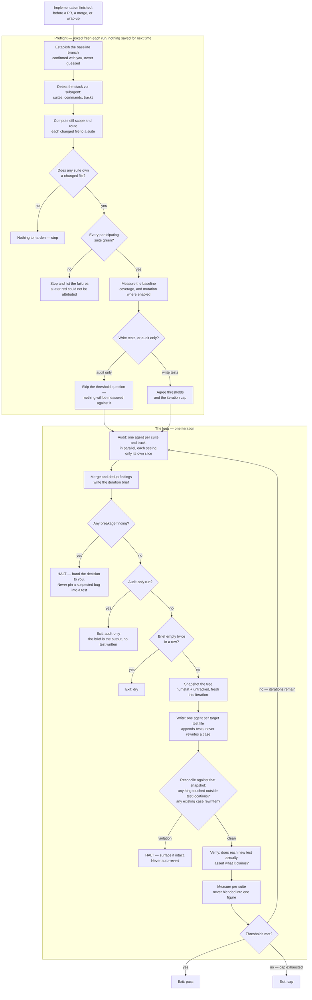

# verity

verity is a Claude Code plugin for diff-scoped test hardening. Point it at a branch diff and
it audits the changed code for weakly-tested behaviour, writes tests — and only tests — to
close the gaps it finds, verifies those tests actually assert what they claim, and repeats
until agreed thresholds are met or it runs out of road.

## Two properties it serves

1. **Verity never modifies application code, and never rewrites an existing test case.** It
   only adds new tests. When code looks wrong rather than untested, it halts and hands the
   decision to a human instead of writing a test that pins the bug in place — see **What
   verity does not guarantee** below for exactly how far that promise is backed.
2. **It is meant to run when implementation work is finished** — before opening a PR, before
   merging, before declaring work done, including when the user says to wrap up. That's the
   moment a diff is stable enough to audit and cheap enough to still fix.

## How it differs from a coverage tool

A coverage tool answers one question: did this line execute during the test run? Verity asks
a different one: **would anything notice if this stopped working?** Those are not the same
question, and 100% coverage is compatible with the answer to the second one being no.

A concrete example. Take a `clamp(value, min, max)` tested only at an interior value —
`clamp 5 0 10`. That single test runs every line of the function, so a coverage tool marks it
fully covered. But neither boundary (`clamp 0 0 10`, `clamp 10 0 10`) nor either out-of-range side (`clamp -1 0 10`,
`clamp 11 0 10`) is ever exercised — the exact values most likely to be wrong in an off-by-one
implementation are precisely the ones nothing checks. Coverage is satisfied; the behaviour
that matters is not. Closing that kind of gap, not raising a percentage, is what verity is
for.

## How a run flows

No command and no config file. It asks for what it needs fresh on every run — baseline branch, how to run each suite, thresholds — and deliberately persists none of it.

Tests judged weak or invalid at the Verify step become rework items carried into the next iteration's audit, along with what was wrong the first time. The two HALT paths are unconditional: verity stops rather than write a test that locks in behaviour it suspects is a bug, and stops rather than quietly revert a file that was touched outside the test surface.

## Installation

Add this repository as a plugin marketplace and install `verity` from it, the same way you'd
install any other Claude Code plugin — see Claude Code's plugin documentation for the
`/plugin marketplace add` / `/plugin install` flow. `.claude-plugin/marketplace.json` and
`.claude-plugin/plugin.json` are already set up for this.

**`jq` is expected to be present.** Verity's own skills carry no shell library and read no
config file, so the plugin itself never shells out to `jq` — but the agents verity dispatches
routinely parse JSON coverage or mutation reports as part of a run, and `jq` is what they use
for that. Install it via your platform's package manager (`brew install jq`, `apt install jq`,
etc.) before running verity.

## How to run it

There is no command and no config file. Invoke the `conducting-test-hardening` skill — either
by name or by finishing implementation work and letting its `description` fire on its own. It
asks for what it needs, fresh, every run: the baseline branch to diff against, how to run each
suite's tests (and, where available, coverage), **whether to write tests at all or only audit**,
and — if it is writing — the coverage threshold and iteration cap to hold the run to.

**Audit-only is offered explicitly**, because it is useful more often than it sounds: when you
want to see the gaps before committing to filling them, when you would rather write the tests
yourself, or when you are still deciding whether the diff is ready. It produces the brief, runs
the breakage check, and stops before a single test is written. The full run is the default if you
have no preference.

Nothing gets written back to disk to save you asking again next time —
that's a deliberate choice, not a missing feature; a prior version of this plugin kept that
information in `.verity/config.json`, and that config layer alone accounted for roughly 15 of
the ~34 defects found during this plugin's build.

## Before it will start

Two preconditions, both checked in preflight:

- **Every participating suite must already be green.** Verity stops if any suite is failing when
  it starts, and lists which. The reason is attribution: with a pre-existing failure in the suite,
  a red result later in the loop cannot be traced to a test verity just wrote, and that signal is
  the thing the whole loop depends on. The practical consequence is worth stating plainly —
  **verity cannot help you while your tests are failing.** Fix or skip the failing suite first;
  it is not a tool for triaging a red build.
- **`jq` must be installed.** Verity's own skills never shell out to it, but the agents that read
  coverage and mutation reports do. If a report exists and `jq` is missing, verity tells you which
  tool is missing rather than quietly disabling that suite's threshold and still reporting `pass`.

## What verity does not guarantee

Stated plainly, because an undocumented gap reads as an oversight and a documented one reads
as a decision.

**There is no enforcement hook.** Nothing mechanically stops a dispatched agent — an auditor,
a writer, a verifier — from writing to application code. Earlier versions of this plugin had
two `PreToolUse` guards and a `Stop` gate for exactly this; all three were removed along with
the config layer they depended on, because between them they accounted for a large share of
the defects found during the build.

**The conductor's post-phase reconciliation catches a bad write after the fact, not before
it.** Immediately before dispatching each iteration's writers, the conductor snapshots the tree
with `git diff --numstat HEAD` plus the untracked list. After the write phase it measures again,
treats a path as touched when it is new or when its line counts have moved, resolves every touched
path (and every symlink discovered under an allowed test location) to where it actually points,
and compares that against the test and fixture locations confirmed during setup. Anything outside
those locations halts the run and surfaces the offending paths and their diff to the user. This is
real — it is what makes the no-app-writes property hold at all — but it runs *after* the write has
already happened. It cannot stop the write itself, and it reverts nothing: it surfaces the
violation and stops, because reverting could destroy evidence the user needs to see intact.

**Your own uncommitted work is not mistaken for a violation.** Verity is meant to run on a branch
before a PR, so a dirty tree is the normal starting state. The snapshot is what distinguishes your
in-progress edits from a writer's — and it is taken fresh each iteration, so the caches, coverage
files and reports left by earlier suite runs don't accumulate into false alarms either. Note the
limit of that: a file you had already modified is recorded, not exempted. If a writer changes it,
its counts move and it is flagged like anything else.

**Verity can be skipped.** There is no blocking gate standing between "done" and actually
running this. Adoption rests on the conducting-test-hardening skill's own `description` firing
at the right moment, on a table of rationalizations inside it, and on a `SessionStart` hook
(`hooks/hooks.json`) that puts the trigger rule in front of the model at the start of every
conversation. None of that is enforcement — all of it can be talked past by a confident enough
"I'll do it after this."

